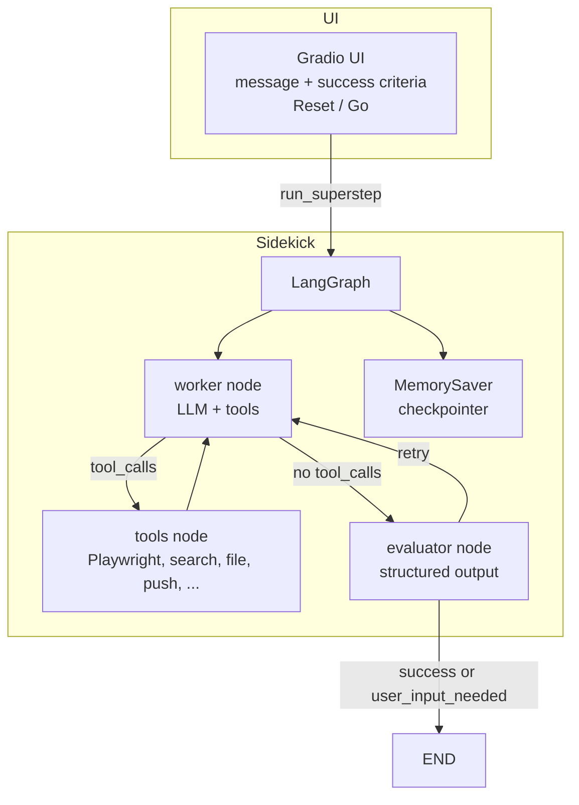

# ai-coworker

[](https://github.com/aditya-caltechie/ai-sidekick/actions)

**CoWorker** is an AI-powered “personal co-worker” that takes your request and optional **success criteria**, then works autonomously until it meets those criteria or needs your input. It uses a **worker** LLM with tools (**browser, search, files, push, Wikipedia, Python REPL**), a separate **evaluator** LLM that checks the worker’s answers against your criteria, and a **retry loop** so the worker can improve when the evaluator says “not yet.” Conversation state is checkpointed per thread. The **Gradio** UI lets you send messages, set success criteria, and see the assistant’s reply plus evaluator feedback.

### Not just a chat box: a personal co-worker

Sidekick is **active personal assistance**, not a passive “type a message, get a reply” chat. You give a **task** and (optionally) **success criteria**; the **worker** uses real tools (browser, search, files, code, push) in a loop; the **evaluator** checks whether the result actually meets your criteria. If not, the agent **retries** with the evaluator’s feedback until the bar is cleared or the system needs you to clarify. That is how it “works until the criteria are met” (or it explicitly needs your input).

### What you can do: tools, where they come from, and example use cases

| Tool(s) | Source in code | Role | Example use cases |
|---------|----------------|------|-------------------|
| **Playwright browser** | `playwright_tools()` | Open pages, click, fill forms, follow links, take screenshots, extract text. For tasks that need a **real website**, not just a search snippet. | “Check the latest headlines on CNN and summarize,” “Open this booking page and read the available slots,” “Scrape the menu from a restaurant site.” |
| **Search (Serper)** | `other_tools()` → `search` (when `SERPER_API_KEY` is set) | Web search: current facts, news, “find X near Y,” product or price lookups. | “What’s the current price of X?”, “Recent news about Y,” “Find an Indian restaurant in Dublin, CA.” |
| **Wikipedia** | `other_tools()` → `WikipediaQueryRun` | Encyclopedic facts: definitions, short summaries, background. | “What is photosynthesis?”, “When was the Eiffel Tower built?”, disambiguation before a deeper search. |
| **Python REPL** | `other_tools()` → `PythonREPLTool` | Run **arbitrary Python**: math, data in memory, small scripts, `print()` for output. The worker must use `print()` to get visible tool output. | “What is π×3?”, “Sum this list…”, “Parse a string and show the result,” ad-hoc calculations or data checks. |
| **File tools** | `get_file_tools()` in `other_tools()` | `read_file` / `write_file` / `list_dir` under **`sandbox/`** only. | “Write a markdown report to `dinner.md`,” “Save a script or notes,” “Read back the file I just created.” |
| **Push notification** | `other_tools()` → `send_push_notification` | Send a real notification (e.g. **Pushover**) to your phone. | “Notify me with the restaurant name and phone when you’re done,” “Ping me the CNN headline list,” task-done alerts. |

**Scope in one line:** If the job can be done with **browsing, searching, looking up facts, running Python, writing/reading files in `sandbox/`, or notifying you**, Sidekick can try to do it—**driven by your success criteria** and **checked by the evaluator** until the answer is good enough or you’re asked to step in.

---

## What it does and how it works

- **Worker**: One LLM (e.g. gpt-4o-mini) that interprets your request and chooses which tools to call. It keeps going until it has a final answer (no more tool calls) or needs your help.
- **Evaluator**: A second LLM with structured output (`EvaluatorOutput`). It decides (1) whether the worker’s last response meets the success criteria and (2) whether more user input is needed. If not done and user not needed, the graph **retries** by sending the worker back with feedback.
- **Loop**: Worker → tools (if tool calls) or → evaluator (if no tool calls). Tools → worker again. Evaluator → **END** (done or user input needed) or → worker (retry with feedback).
- **State**: Messages, success criteria, evaluator feedback, and flags are stored in graph state and persisted with a checkpointer (MemorySaver) per conversation thread.

Configuration and tool wiring are in `src/sidekick_tools.py` and `src/sidekick.py`. For walkthroughs, see [docs/DEMO.md](docs/DEMO.md).

---

## High-level architecture



**Flow**: User message + success criteria → graph runs. Worker may call tools repeatedly; when it stops calling tools, the evaluator runs. Evaluator either ends the run or sends the worker back with feedback (retry). Full design: [docs/HLD.md](docs/HLD.md).

---

## Tech stack

| Layer | Tech |
|-------|------|
| **Orchestration** | LangGraph (state graph, conditional edges, checkpointer) |
| **LLM** | OpenAI (ChatOpenAI, gpt-4o-mini) via LangChain |
| **Tools** | LangChain (StructuredTool, toolkits), Playwright, Serper API, Pushover, Wikipedia |
| **Memory** | LangGraph MemorySaver (in-process checkpointer) |
| **UI** | Gradio |
| **Observability** | LangSmith (optional tracing) |
| **Package / run** | uv, Python ≥3.12 |

---

## How to run

**Prerequisites**: Python 3.12+, [uv](https://docs.astral.sh/uv/), and (for browser tools) Playwright Chromium.

```bash
# Clone and enter repo
cd ai-sidekick

# Install dependencies (includes dev group for tests)
uv sync --all-groups

# Install Playwright Chromium (required for browser tools)
uv run playwright install chromium

# Optional: set API keys in .env (see below)
# OPENAI_API_KEY is required. SERPER_API_KEY, PUSHOVER_* for search/push.

# Run the app
uv run src/app.py
```

Then open the URL (e.g. http://127.0.0.1:7860). Use the chat to send a message and (optionally) success criteria; click **Go!** to run one superstep.

**Run tests** (no LLM/Playwright; tools mocked):

```bash
uv run pytest tests/ -v
```

---

## Essential setup

| Item | Notes |
|------|--------|
| **OPENAI_API_KEY** | Required. Used by worker and evaluator. |
| **SERPER_API_KEY** | Optional. If set, the search tool is enabled; if unset, app and tests still run (search tool omitted). |
| **PUSHOVER_TOKEN**, **PUSHOVER_USER** | Optional. For the push notification tool. |
| **Playwright** | Run `uv run playwright install chromium` after `uv sync` if you use browser tasks. |
| **LangSmith** | Set `LANGCHAIN_TRACING_V2=true`, `LANGCHAIN_PROJECT`, `LANGCHAIN_API_KEY` to trace runs. |

---

## Docs

| Doc | Description |
|-----|-------------|
| [docs/HLD.md](docs/HLD.md) | High-level design: graph, state, tools, evaluator, retry, who decides what. |
| [docs/BASICS.md](docs/BASICS.md) | LangGraph basics, five steps to build a graph, tools/memory/loop. |
| [docs/DEMO.md](docs/DEMO.md) | Demo 1–4: CNN + push, math (REPL), Python code generation, restaurant + `dinner.md` + push; screenshots and LangSmith traces. |
| [docs/OBSERVABILITY.md](docs/OBSERVABILITY.md) | LangSmith tracing, tool usage in traces, how it helps. |
| [docs/GUARDRAILS.md](docs/GUARDRAILS.md) | Where and how to add guardrails (input/output/tools/evaluator) with code samples. |
| [docs/EVALUATION.md](docs/EVALUATION.md) | How evaluation works (in-loop evaluator, offline eval), customization, and examples. |
| [AGENTS.md](AGENTS.md) | Contributor map: repo layout, key components, config, run commands, pitfalls. |

## Notes
LangGraph is orchestration layer - which can we used for making both workflow and agentic solutions. However it makes more sense to use for agentic solution where we can give more autonomy to choose tools and loop actions based on feedback/evaluation/response along with guardrails.
- **Workflows** : example traditional rag. Simpler. [Reference-1](https://github.com/aditya-caltechie/ai-langchain-intro/blob/main/docs/LangGraph.md) | 
[Reference-2](https://github.com/aditya-caltechie/ai-langchain-intro/tree/main/src/rag)
- **Full Agnetic solution** : example agentic-rag repo, ai-sidekick repo. LangGraph notebooks lab-2,3.
